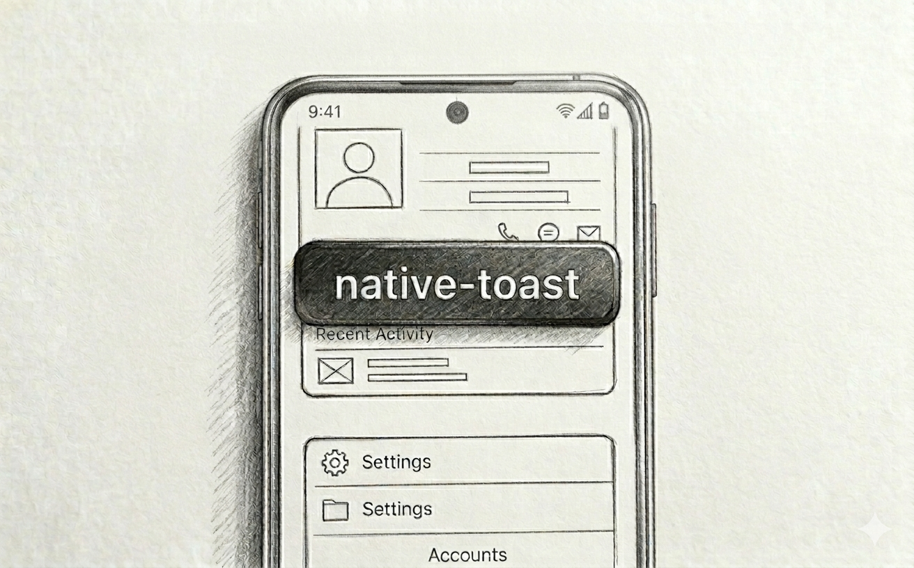
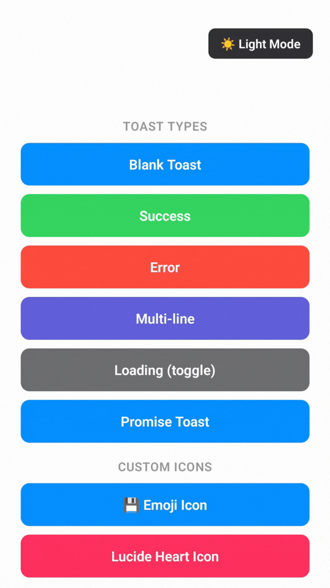
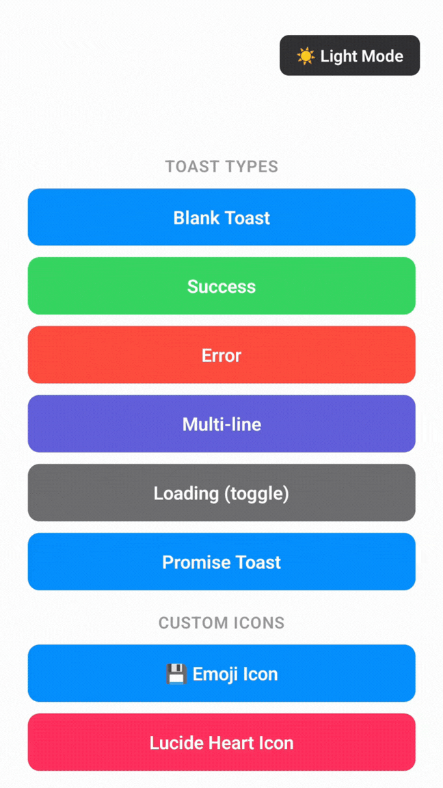
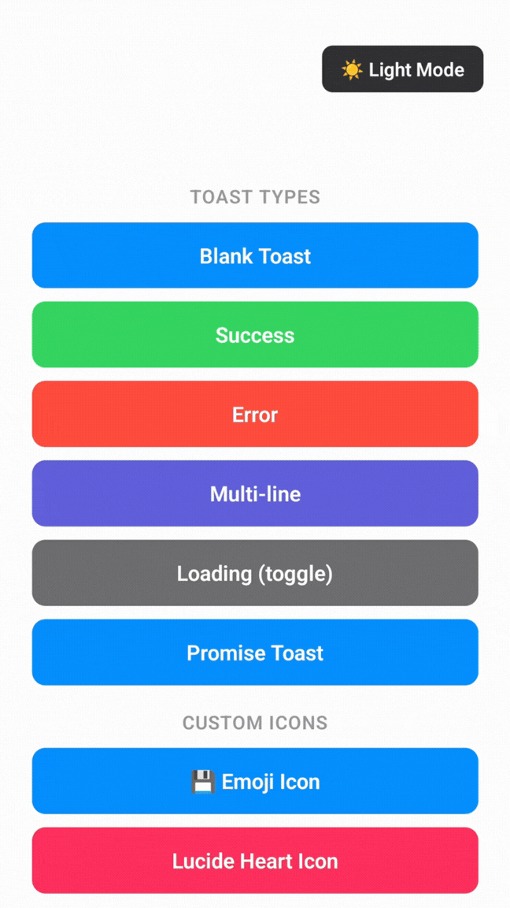
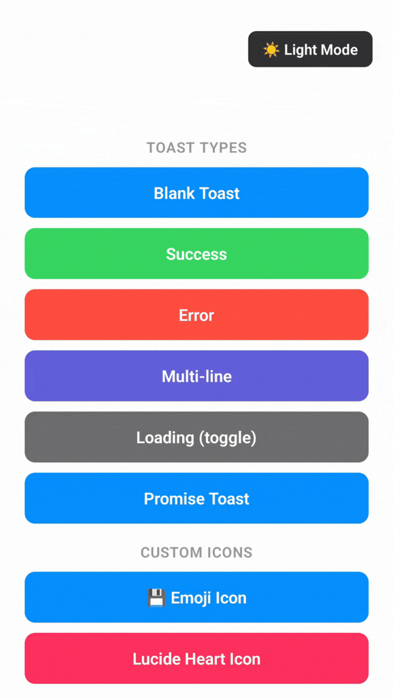
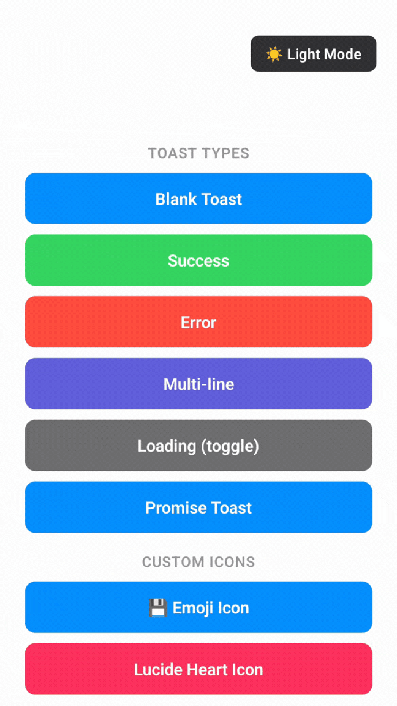
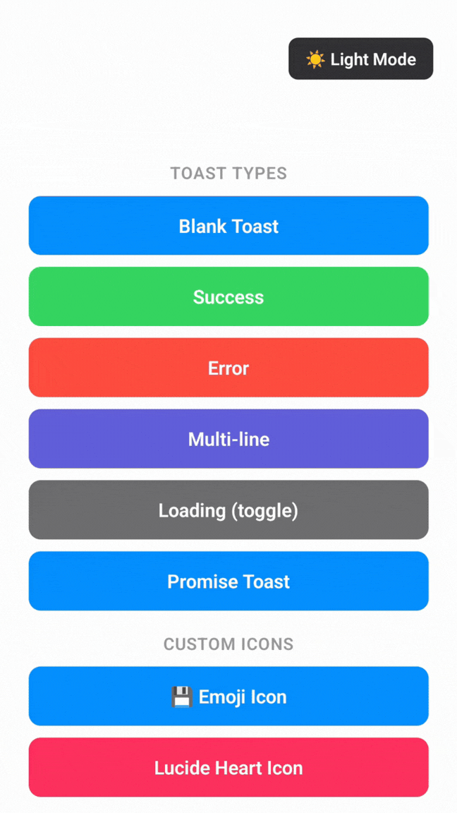
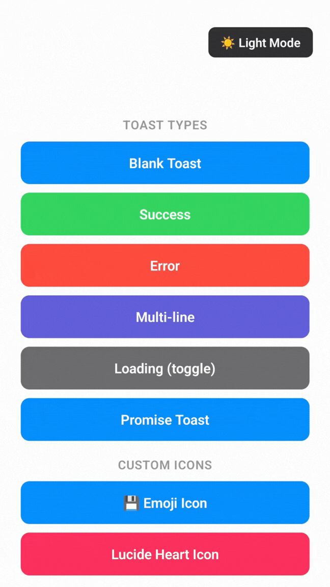
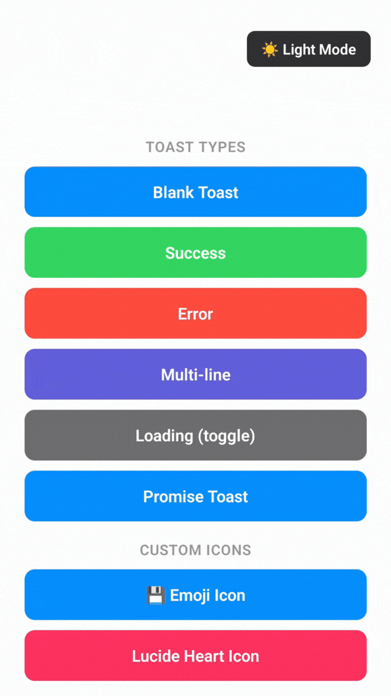
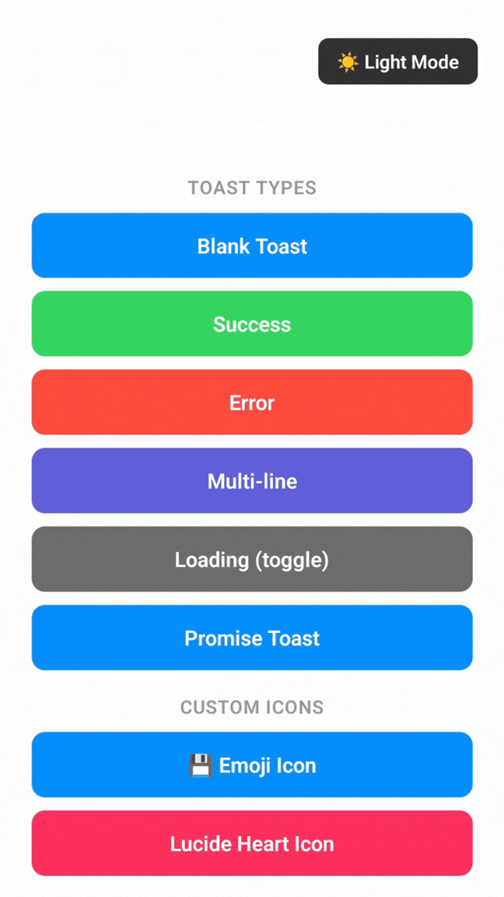

# NativeToast

A zero-dependency, headless toast notification system for React Native (Expo) with an imperative API, animated SVG icons, stack mode, swipe dismiss, custom icons, and dark/light themes.

## Preview

<p align="center"></p>

## Examples

| Example | Preview | Docs |
|---------|---------|------|
| Success |  | [Toast Types](https://native-toast-nc.vercel.app/features/toast-types) |
| Error |  | [Toast Types](https://native-toast-nc.vercel.app/features/toast-types) |
| Loading |  | [toast.loading](https://native-toast-nc.vercel.app/api/toast#toastloadingmessage-options) |
| Promise |  | [toast.promise](https://native-toast-nc.vercel.app/api/toast#toastpromisepromise-messages-options) |
| Stack Mode |  | [Stack Mode](https://native-toast-nc.vercel.app/features/stack-mode) |
| Custom Icon |  | [Custom Icons](https://native-toast-nc.vercel.app/features/custom-icons) |
| Emoji Icon |  | [Emoji Icons](https://native-toast-nc.vercel.app/features/custom-icons#emoji-icons) |
| Multiline |  | [Message Types](https://native-toast-nc.vercel.app/features/toast-types#message-types) |
| Default |  | [Toast Types](https://native-toast-nc.vercel.app/features/toast-types) |
| Theming |  | [Theming](https://native-toast-nc.vercel.app/features/theming) |

## Installation

```bash
pnpm add @ncrft/native-toast
```

## Quick Start

```tsx
import { ToastContainer, toast } from '@ncrft/native-toast';
import { SafeAreaProvider } from 'react-native-safe-area-context';

export default function App() {
  return (
    <SafeAreaProvider>
      {/* your app */}
      <ToastContainer />
    </SafeAreaProvider>
  );
}

// Call from anywhere
toast.success('Settings saved!');
```

## Documentation

Full docs at **[native-toast-nc.vercel.app](https://native-toast-nc.vercel.app)**
